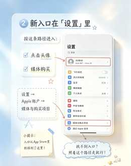

# 下周七.教程手帐

**Xiazhouqi Tutorial Handbook Skill**

把教学截图、手机设置步骤、软件教程等内容，转换成移动端优先的精致教程网页。

## 视觉基准

这两张图是本 Skill 的**视觉锚点**。以后制作新教程时，不只看文字规范，也要先对照这两张参考图理解整体质感。

<p align="center">
  
  
</p>

重点不是逐像素照抄，而是保持同一套视觉语言：**雾蓝、奶白、暖黄、轻毛玻璃、柔和立体阴影、手机主视觉、便利贴与克制的手绘标记。**

## 风格关键词

雾蓝 · 奶白 · 暖黄 · 毛玻璃 · 柔和阴影 · 手机界面仿真 · 便利贴 · 手绘标记

## 使用方式

当你提供教程截图后，可以直接说：

> 按「下周七.教程手帐」做成网页

默认规则：

- 手机端优先
- 自然连续滚动
- 禁止横向溢出
- 不使用强制 `scroll-snap`
- 简单手机 / App 界面优先用 HTML + CSS 重构
- 保留轻、透、柔和的玻璃立体感
- 制作前先看 `references/` 中的视觉参考图

完整规范见 [`SKILL.md`](./SKILL.md)。

可运行参考实现见 [`examples/appstore-account-switch.html`](./examples/appstore-account-switch.html)。

## 仓库结构

```text
xiazhouqi-tutorial-handbook-skill/
├── SKILL.md
├── README.md
├── references/
│   ├── tutorial-handbook-template-01.jpeg
│   └── tutorial-handbook-template-02.jpeg
└── examples/
    └── appstore-account-switch.html
```

## Version

v1.1.0
